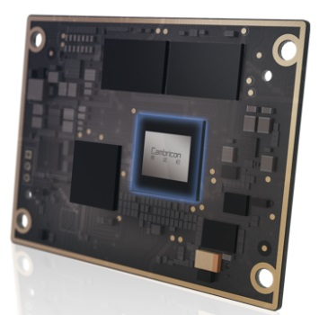
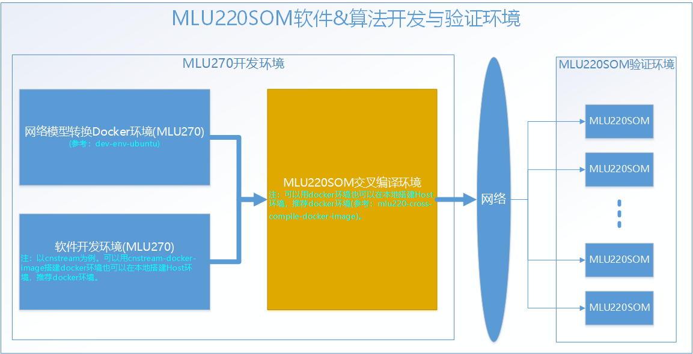

<p align="center">
    <a href="https://github.com/CambriconKnight/mlu220-cross-compile-docker-image">
        
        <h1 align="center">Edge交叉编译工具集</h1>
    </a>
</p>

# 1. 概述

本[工具集](https://github.com/CambriconKnight/edge-cross-compile-docker-image)主要用于搭建基于寒武纪边缘侧产品交叉编译环境以及一些常用实例的交叉编译与验证。

此工具集开发宗旨是"一键编译与验证", 力求压缩环境搭建与功能验证的时间成本, 以便更快上手[MLU220-SOM](https://www.cambricon.com/index.php?m=content&c=index&a=lists&catid=56)等边缘侧产品。

<p align="left">
    
</p>

**功能说明**

此工具包集成了如下功能:

- 基于Dockerfile自动编译Docker镜像 >> 启动Docker容器
- ~~系统完整源码包交叉编译与验证~~
- ~~CNStream交叉编译与验证~~
- ~~CNRT交叉编译与验证~~
- ~~FFmpeg-MLU交叉编译与验证~~
- ~~CNCodec交叉编译与验证~~
- ~~EasyDK交叉编译与验证~~
- ~~单独交叉编译第三方常用工具: GFlags、Glogs、OpenCV、FFMpeg、Live555、FreeType、Perf~~

**硬件环境准备:**

| 名称           | 数量      | 备注                  |
| :------------ | :--------- | :------------------ |
| 开发主机/服务器  | 一台       | 主流配置即可          |
| MLU220SOM     | 一台       |                     |
| 电源适配器      | 一套       | 12V 2A DC电源输出    |
| USB转TTL串口线  | 一条       |                    |

**软件环境准备:**

| 名称                   | 版本/文件                                              | 备注                                 |
| :-------------------- | :-------------------------------                      | :---------------------------------- |
| Linux OS              | Ubuntu16.04/Ubuntu18.04/CentOS7                       | 宿主机操作系统                         |
| 交叉编译工具集          | edge-cross-compile-docker-image                      | 边缘侧产品交叉编译工具集               |
| GCC_LINARO           | gcc-linaro-6.2.1-2016.11-x86_64_aarch64-linux-gnu.tgz | ARM64 交叉编译器                       |

注: 以上软件环境中文件名词, 如有版本升级及名称变化, 可以在 [env.sh](./env.sh) 中进行修改。

**下载地址:**

Ubuntu16.04: http://mirrors.aliyun.com/ubuntu-releases/16.04

边缘侧产品交叉编译工具集: https://github.com/CambriconKnight/edge-cross-compile-docker-image

Neuware SDK: https://cair.cambricon.com/#/home/catalog?type=SDK%20Release

其他开发资料, 可前往[寒武纪开发者社区](https://developer.cambricon.com)注册账号按需下载。也可在官方提供的专属FTP账户指定路径下载。

**预装软件**

以下软件/工具已经安装到Docker容器中了:

- curl
- git
- wget
- vim
- cmake
- make
- opencv(x86)
- glog(x86)
- ssh
- tree
- minicom
- tftpd
- nfs
- net-tools
- gcc-linaro

**环境变量**

以下环境变量在Docker容器中已经设置:

- BIN_DIR_GCC_Linaro=/opt/work/gcc-linaro-6.2.1-2016.11-x86_64_aarch64-linux-gnu/bin
- BIN_DIR_GCC_ARM=/opt/work/gcc-arm-none-eabi-8-2018-q4-major/bin
- PATH=$BIN_DIR_GCC_Linaro:$BIN_DIR_GCC_ARM:$PATH
- NEUWARE_HOME=/opt/work/neuware/pc

# 2. 目录结构

```bash
.
├── build-image.sh     （编译docker镜像）
├── clean.sh           （清理Build出来的临时目录或文件,包括镜像文件,已加载的镜像,已加载的容器等）
├── docker             （存储dockerfile相关文件）
├── load-image.sh      （加载docker镜像）
├── README.md          （readme）
├── res                （readme文档中涉及到的图片资源存放路径）
├── run-container.sh   （启动docker容器）
└── tools              （交叉编译中常用的小工具和脚本）
```

# 3. 下载源码
```bash
git clone https://github.com/CambriconKnight/edge-cross-compile-docker-image.git
```

# 4. 编译镜像
```bash
#编译完成后，会在本地生成一个docker镜像。
#编译Docker镜像：安装 gcc-linaro
./build-image.sh
#./build-image.sh -l 1
```
编译后会在docker目录下生存一个镜像文件。$VERSION版本以实际为准
```bash
......
====================== save image ======================
-rw-rw-r-- 1 root root 1979560448 9月   9 18:15 ./docker/image-ubuntu16.04-edge-cross-compile-v1.0.0.tar.gz
```

# 5. 加载镜像
```bash
#加载Docker镜像
./load-image.sh
```

# 6. 启动容器
```bash
#启动Docker容器
./run-container.sh
```

# 7. 环境验证
```bash
#执⾏以下命令，确认aarch64-linux-gnu-gcc版本信息：
aarch64-linux-gnu-gcc -v
```
